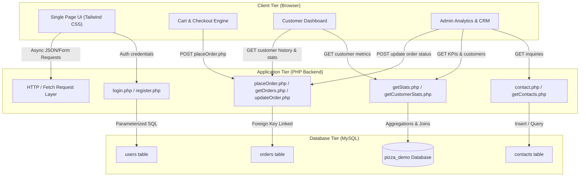

# ?? Pizza Palace — Full-Stack Ordering & Restaurant Management System

[](https://www.php.net/)
[](https://www.mysql.com/)
[](https://tailwindcss.com/)
[](LICENSE)
[](#)

A modern, responsive full-stack online pizza ordering and store management web application built using **PHP**, **MySQL**, **Tailwind CSS**, and asynchronous **JavaScript (Fetch API)**. 

The platform features a dual-dashboard architecture: an intuitive, friction-free ordering experience for customers and a comprehensive administrative portal for real-time order tracking, customer profiling, financial analytics, and message management.

---

## ?? Table of Contents

- [Overview](#overview)
- [Key Features](#key-features)
  - [Customer-Facing Portal](#customer-facing-portal)
  - [Administrative Dashboard](#administrative-dashboard)
- [Tech Stack](#tech-stack)
- [System Architecture](#system-architecture)
- [Directory Structure](#directory-structure)
- [Database Setup & Schema](#database-setup--schema)
- [Installation Guide](#installation-guide)
  - [Prerequisites](#prerequisites)
  - [Local Development Setup](#local-development-setup)
  - [Option A: PHP Built-in Server](#option-a-php-built-in-server)
  - [Option B: XAMPP / WAMP / LAMP](#option-b-xampp--wamp--lamp)
- [Admin Credentials](#admin-credentials)
- [API Endpoints Reference](#api-endpoints-reference)
- [Security & Best Practices](#security--best-practices)
- [Screenshots & UI Showcase](#screenshots--ui-showcase)
- [Roadmap & Future Enhancements](#roadmap--future-enhancements)
- [Contributing](#contributing)
- [License](#license)

---

## ?? Overview

Pizza Palace was engineered to simulate an end-to-end commercial restaurant ordering platform. It bridges responsive frontend design with a lightweight, decoupled PHP JSON backend, delivering single-page application (SPA) responsiveness without heavy JavaScript frameworks.

---

## ? Key Features

### ?? Customer-Facing Portal
- **Interactive Menu & Cart System**: Add to cart, adjust quantities dynamically, real-time total recalculation, and slide-out cart sidebar.
- **Secure Authentication**: User registration with input sanitation, regex phone validation, and **Bcrypt** password hashing.
- **Customer Account Dashboard**:
  - Live order tracking and chronological order history.
  - Personalized stats: total orders placed, cumulative spending, member-since date, and favorite pizza computation.
  - Profile information overview (name, phone, delivery address).
- **Contact & Feedback Module**: Direct inquiry submission persisted into the database.

### ??? Administrative Dashboard
- **Live Order Management**: View all incoming orders in real time, sort chronologically, and change statuses (`Pending` ? `In Progress` ? `Delivered`) via instantaneous AJAX requests.
- **Customer CRM**: Aggregate table displaying all registered customers, lifetime order count, and total spend per customer.
- **Business Intelligence & KPIs**:
  - Real-time gross revenue tracker (filtered by delivered orders).
  - Total order volume monitor.
  - Registered customer base counter.
- **Inquiry Inbox**: View customer contact submissions with timestamps and message details.

---

## ??? Tech Stack

| Layer | Technologies Used |
| :--- | :--- |
| **Frontend** | HTML5, JavaScript (ES6+ Fetch API, DOM manipulation), Tailwind CSS (Utility-first styling), Google Fonts (Poppins) |
| **Backend** | PHP 8.x (RESTful JSON APIs, Prepared Statements, Procedural/Modular handlers) |
| **Database** | MySQL 8.x (InnoDB Engine, Foreign Key constraints, utf8mb4 collation) |
| **Security** | Bcrypt password hashing (`PASSWORD_BCRYPT`), Prepared SQL Parameter Binding (`mysqli::prepare`) |
| **DevOps / Tooling** | Git, GitHub, XAMPP / Apache / PHP CLI Server |

---

## ??? System Architecture



---

## ?? Directory Structure

```text
pizza-website/
+-- database/
¦   +-- schema.sql             # Idempotent DB schema, indexes, constraints, and seed data
+-- assets/                    # Static UI resources (optional modular extraction)
¦   +-- css/
¦   +-- js/
¦   +-- images/
+-- .env.example               # Template for environment configuration
+-- .gitignore                 # Exclusion rules for secrets, OS files, and dependencies
+-- contact.php                # Endpoint: Handles contact form submissions
+-- db.php                     # Centralized database connection script
+-- getContacts.php            # Endpoint: Fetches contact inquiries for Admin portal
+-- getCustomerStats.php       # Endpoint: Aggregates personalized metrics for customer
+-- getCustomers.php           # Endpoint: Aggregates customer CRM table for Admin
+-- getOrders.php              # Endpoint: Retrieves customer-specific or all store orders
+-- getStats.php               # Endpoint: Computes executive dashboard KPIs (Revenue, Volume)
+-- index.html                 # Main Single Page Application interface
+-- login.php                  # Endpoint: Authenticates users & returns role-based metadata
+-- placeOrder.php             # Endpoint: Persists customer orders
+-- register.php               # Endpoint: Validates and registers new customer accounts
+-- updateOrder.php            # Endpoint: Updates order fulfillment status
+-- README.md                  # Comprehensive project documentation
```

---

## ??? Database Setup & Schema

The relational database uses **InnoDB** with `utf8mb4_unicode_ci` for full character and symbol encoding.

### Entity Relationship Overview:
- **`users`**: Manages credentials, roles (`customer`, `admin`), addresses, and contact numbers.
- **`orders`**: Stores transaction totals, order timestamps, statuses, and links to `users` via `customer_id` (`ON DELETE CASCADE`).
- **`contacts`**: Stores customer feedback and inquiries.

### Quick Database Import:
Using MySQL CLI:
```bash
mysql -u root -p < database/schema.sql
```
Or via **phpMyAdmin**:
1. Open `http://localhost/phpmyadmin`.
2. Click **Import** tab.
3. Select `database/schema.sql` and click **Go**.

---

## ?? Installation Guide

### Prerequisites
- **PHP** >= 8.0 installed on your system.
- **MySQL** >= 5.7 or 8.0 (or MariaDB).
- Apache, Nginx, or PHP CLI built-in web server.
- [Optional] XAMPP / WAMP / MAMP for an all-in-one local server stack.

### Local Development Setup

1. **Clone the Repository**:
   ```bash
   git clone https://github.com/your-username/pizza-website.git
   cd pizza-website
   ```

2. **Configure Database Credentials**:
   - Copy `.env.example` to `.env` (or configure `$host`, `$user`, `$pass`, `$db` in `db.php`):
   ```php
   $host = "localhost";
   $user = "root";
   $pass = "";
   $db   = "pizza_demo";
   ```

3. **Initialize the Database**:
   Import `database/schema.sql` into MySQL as shown in the Database Setup section above.

### How to Run the Project

#### Option A: PHP Built-in Server (Lightweight, No Apache Needed)
Run the following command in the root directory:
```bash
php -S localhost:8000
```
Open your browser and navigate to:
```text
http://localhost:8000
```

#### Option B: XAMPP / WAMP / LAMP
1. Move the `pizza-website` folder into your web server document root:
   - **XAMPP (Windows)**: `C:\xampp\htdocs\pizza-website`
   - **XAMPP (macOS)**: `/Applications/XAMPP/xamppfiles/htdocs/pizza-website`
   - **LAMP (Linux)**: `/var/www/html/pizza-website`
2. Start **Apache** and **MySQL** modules from the XAMPP Control Panel.
3. Open your browser and navigate to:
   ```text
   http://localhost/pizza-website
   ```

---

## ?? Admin Login Instructions

The database migration seeds an administrative user account by default:

- **Admin Portal Access**: Click **Login** on the top navigation bar.
- **Admin Email**: `admin@demo.com`
- **Default Password**: `admin123`
- **Role**: `admin`

> ?? **Security Warning**: Change the default admin password immediately before deploying to any publicly accessible or staging server.

---

## ?? API Endpoints Reference

| Endpoint | Method | Params / Payload | Access | Description |
| :--- | :--- | :--- | :--- | :--- |
| `login.php` | `POST` | `email`, `password` | Public | Authenticates credentials and returns user details. |
| `register.php` | `POST` | `name`, `email`, `phone`, `address`, `password` | Public | Registers a new customer account. |
| `placeOrder.php` | `POST` | `customer_id`, `items`, `total` | Customer | Saves a new customer order into the database. |
| `getOrders.php` | `GET` | `[customer_id]` | Auth | Returns orders for a specific customer or all store orders. |
| `updateOrder.php` | `POST` | `id`, `status` | Admin | Updates order fulfillment lifecycle status. |
| `getStats.php` | `GET` | *None* | Admin | Returns aggregate metrics (Total Orders, Revenue, Customers). |
| `getCustomers.php` | `GET` | *None* | Admin | Returns list of all customers with aggregated spending. |
| `getCustomerStats.php`| `GET` | `customer_id` | Customer | Returns favorite pizza, member-since date, and totals. |
| `contact.php` | `POST` | `name`, `email`, `message` | Public | Persists customer inquiries to the database. |
| `getContacts.php` | `GET` | *None* | Admin | Retrieves all contact submissions for review. |

---

## ??? Security & Best Practices

- **Parameterized Queries**: All database mutations and lookups utilize `mysqli::prepare()` with parameter type binding to mitigate **SQL Injection (SQLi)**.
- **Cryptographic Hashing**: User passwords are encrypted using `password_hash($password, PASSWORD_BCRYPT)`. Plaintext passwords are never stored.
- **Payload Sanitization**: Server-side inputs are trimmed and validated via regular expressions (`preg_match` for phone numbers).
- **Sensitive Data Exclusion**: Database credentials and sensitive setup scripts are guarded via `.gitignore`.

---

## ?? Screenshots & UI Showcase

| Desktop Landing & Menu | Real-Time Cart & Checkout |
| :---: | :---: |
|  |  |

| Customer Dashboard & Tracking | Admin Analytics & Order Control |
| :---: | :---: |
| ![Customer Portal]) |  |

*(Replace placeholder URLs with actual screenshots of your running instance before sharing.)*

---

## ?? Roadmap & Future Enhancements

- [ ] **Server-Side Session Authentication**: Transition from client-side stored session state to secure HTTP-only cookies (`$_SESSION`) with CSRF protection tokens.
- [ ] **Normalized Order Items Schema**: Deconstruct the comma-separated `items` string into a relational `order_items` table with foreign key linkage to a `products` table.
- [ ] **Server-Side Price Calculation**: Validate and recalculate cart totals on the backend based on database product prices to eliminate client-side price tampering.
- [ ] **Payment Gateway Integration**: Implement Stripe or Razorpay webhooks for automated payment verification.
- [ ] **RESTful Controller Architecture**: Refactor procedural scripts into an MVC structure utilizing Composer autoloader, FastRoute, and Twig templating.
- [ ] **Automated Unit Testing**: Integrate PHPUnit test suites covering authentication, order placement, and API validation logic.

---

## ?? Contributing

Contributions are welcome! Please follow these steps:
1. Fork the repository.
2. Create your feature branch (`git checkout -b feature/AmazingFeature`).
3. Commit your changes (`git commit -m "feat: Add AmazingFeature"`).
4. Push to the branch (`git push origin feature/AmazingFeature`).
5. Open a Pull Request.

---

## ?? License

Distributed under the **MIT License**. See `LICENSE` for more information.
